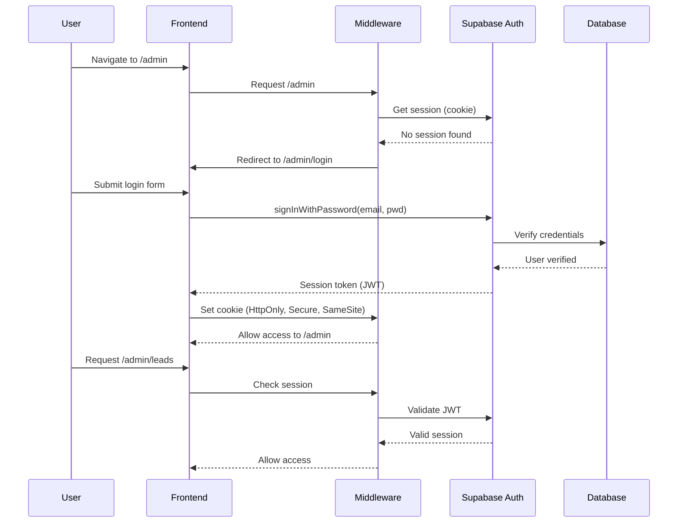
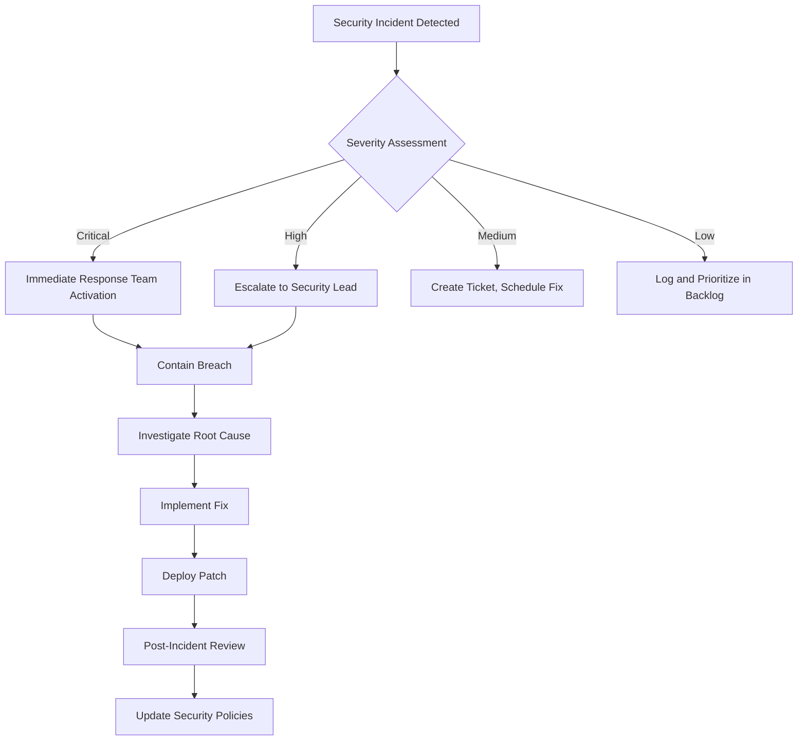

# SYSTEM DESIGN DOCUMENT - PART 2

_Continuation of Software Requirements & System Design Document (SRS + SRD)_

---

# 7. API DOCUMENTATION

## 7.1 API Architecture Overview

**API Style:** RESTful HTTP API
**Implementation:** Next.js App Router API Routes (Serverless Functions)
**Base URL:** `https://jschoicegroup.com.au/api`
**Authentication:** Supabase JWT (Cookie-based)
**Response Format:** JSON

### Standard Response Structure

**Success Response:**
```json
{
  "success": true,
  "data": {...},
  "message": "Operation successful" // optional
}
```

**Error Response:**
```json
{
  "success": false,
  "error": "Error description"
}
```

**Paginated Response:**
```json
{
  "success": true,
  "data": [...],
  "pagination": {
    "total": 150,
    "page": 1,
    "limit": 20,
    "totalPages": 8
  }
}
```

## 7.2 Complete API Endpoints

### Analytics APIs

| Endpoint | Method | Auth | Description | Query Params |
|----------|--------|------|-------------|--------------|
| `/api/analytics/leads` | GET | ✅ Required | Lead analytics & trends | `days` (default: 30) |
| `/api/analytics/overview` | GET | ✅ Required | Dashboard stats | None |

**Example: GET /api/analytics/leads?days=30**
```json
{
  "success": true,
  "data": {
    "summary": {
      "total": 150,
      "new": 25,
      "contacted": 40,
      "qualified": 30,
      "won": 20,
      "lost": 10,
      "conversionRate": 13.33
    },
    "byStatus": { "new": 25, "contacted": 40, ... },
    "bySource": { "contact_form": 80, "service_matcher": 70 },
    "byPriority": { "normal": 100, "high": 50 },
    "trends": {
      "leads": { "2026-02-01": 5, "2026-02-02": 8, ... },
      "activity": { "2026-02-01": 12, ... }
    }
  }
}
```

---

### Authentication APIs

| Endpoint | Method | Auth | Description | Body Parameters |
|----------|--------|------|-------------|-----------------|
| `/api/auth/session` | GET | ✅ Required | Get current session | None |
| `/api/auth/logout` | POST | ✅ Required | Logout user | None |

**Example: GET /api/auth/session**
```json
{
  "success": true,
  "data": {
    "user": {
      "id": "uuid",
      "email": "admin@jschoicegroups.com",
      "user_metadata": {...}
    },
    "expiresAt": 1708473600
  },
  "message": "Session active"
}
```

---

### Blog APIs

| Endpoint | Method | Auth | Description | Query/Body Params |
|----------|--------|------|-------------|-------------------|
| `/api/blog` | GET | Optional | List blog posts | `admin`, `category`, `status`, `search`, `page`, `limit` |
| `/api/blog` | POST | ✅ Required | Create blog post | See body spec below |
| `/api/blog/[slug]` | GET | Optional | Get single post | `admin` (query) |
| `/api/blog/[slug]` | PATCH | ✅ Required | Update post | Partial fields |
| `/api/blog/[slug]` | DELETE | ✅ Required | Delete post | None |
| `/api/blog/categories` | GET | Public | List categories | None |
| `/api/blog/scheduler` | GET | Cron Secret | Auto-publish scheduled | None |
| `/api/blog/upload` | POST | ✅ Required | Upload image | `file` (multipart) |

**POST /api/blog Body:**
```json
{
  "title": "Understanding NDIS Support Coordination",
  "slug": "understanding-ndis-support-coordination",
  "content": "<p>Full HTML content...</p>",
  "excerpt": "Brief summary",
  "category": "ndis-news",
  "tags": ["ndis", "support"],
  "featured_image": "https://...",
  "meta_title": "SEO title",
  "meta_description": "SEO description",
  "status": "draft" | "published" | "scheduled",
  "author_name": "JS Choice Team",
  "scheduled_for": "2026-02-20T10:00:00Z" // if status=scheduled
}
```

---

### Gallery APIs

| Endpoint | Method | Auth | Description | Body Parameters |
|----------|--------|------|-------------|-----------------|
| `/api/gallery` | GET | Public | List gallery items | None |
| `/api/gallery` | POST | ✅ Required | Create gallery item | `title`, `description`, `images`, `category`, `display_order` |
| `/api/gallery/[id]` | GET | Public | Get single item | None |
| `/api/gallery/[id]` | PUT | ✅ Required | Update item | Full item object |
| `/api/gallery/[id]` | DELETE | ✅ Required | Delete item | None |
| `/api/gallery/upload` | POST | ✅ Required | Upload images | `file` (multipart, multiple) |

**POST /api/gallery Body:**
```json
{
  "title": "Community Event 2026",
  "description": "Annual community gathering",
  "images": ["https://...", "https://...", "https://..."],
  "category": "events",
  "display_order": 1
}
```

---

### Leads APIs

| Endpoint | Method | Auth | Description | Query/Body Params |
|----------|--------|------|-------------|-------------------|
| `/api/leads` | GET | ✅ Required | List leads | `page`, `limit`, `status`, `source`, `search`, `priority`, `dateFrom`, `dateTo` |
| `/api/leads` | POST | Public | Create lead | See body spec below |
| `/api/leads/[id]` | GET | ✅ Required | Get single lead | None |
| `/api/leads/[id]` | PUT | ✅ Required | Update lead | Partial fields |
| `/api/leads/[id]` | DELETE | ✅ Required | Delete lead | None |
| `/api/leads/export` | GET | ✅ Required | Export to CSV | Same filters as GET /leads |
| `/api/leads/[id]/activities` | GET | ✅ Required | Get activity log | None |
| `/api/leads/[id]/activities` | POST | ✅ Required | Add activity | `activity_type`, `title`, `description` |
| `/api/leads/[id]/email` | POST | ✅ Required | Send email | `subject`, `message` |
| `/api/leads/[id]/tasks` | GET | ✅ Required | Get tasks | `includeCompleted` |
| `/api/leads/[id]/tasks` | POST | ✅ Required | Create task | `title`, `due_date`, `priority` |

**POST /api/leads Body (Public Lead Submission):**
```json
{
  "first_name": "John",
  "last_name": "Smith",
  "email": "john@example.com",
  "phone": "0400123456",
  "source": "contact_form",
  "source_page": "/contact-us",
  "ndis_participant": true,
  "ndis_status": "funded",
  "location": "Point Cook",
  "interested_services": ["daily-life", "nursing"],
  "message": "Interested in support services",
  "utm_source": "google",
  "utm_medium": "cpc"
}
```

**PUT /api/leads/[id] Body (Admin Update):**
```json
{
  "status": "contacted",
  "priority": "high",
  "assigned_to": "user-uuid",
  "internal_notes": "Called and left voicemail",
  "next_followup_date": "2026-02-10",
  "next_followup_note": "Call back next week"
}
```

---

### Tasks APIs

| Endpoint | Method | Auth | Description | Body Parameters |
|----------|--------|------|-------------|-----------------|
| `/api/tasks/[taskId]` | PUT | ✅ Required | Update task | Partial task fields |
| `/api/tasks/[taskId]` | PATCH | ✅ Required | Toggle complete | `is_completed` (boolean) |
| `/api/tasks/[taskId]` | DELETE | ✅ Required | Delete task | None |

**PATCH /api/tasks/[taskId] Body:**
```json
{
  "is_completed": true
}
```

---

### NDIS APIs

| Endpoint | Method | Auth | Description | Query Params |
|----------|--------|------|-------------|--------------|
| `/api/ndis/autocomplete` | GET | Public | Category autocomplete | `q` (query), `limit` |
| `/api/ndis/categories` | GET | Public | Get all categories | None |
| `/api/ndis/item/[code]` | GET | Public | Get item detail | None |
| `/api/ndis/search` | GET | Public | Search support items | `q`, `category`, `region`, `limit`, `offset`, `showAll` |
| `/api/ndis/services` | GET | Public | Get JS Choice services | `categories` (filter) |
| `/api/ndis/leads` | POST | Public | Submit service matcher lead | Lead object |

**GET /api/ndis/search Query Params:**
- `q` or `query`: Search term (min 2 chars for keyword, or numeric for item number)
- `category`: Filter by category number
- `region`: Region code (default: 'vic')
- `limit`: Results per page (default: 15, max: 2000)
- `offset`: Pagination offset (default: 0)
- `showAll`: Set to 'true' to bypass search minimum

**Example: GET /api/ndis/search?q=daily living&region=vic&limit=15**
```json
{
  "success": true,
  "data": [
    {
      "id": "uuid",
      "support_item_number": "01_002_0107_1_1",
      "support_item_name": "Assistance with daily life tasks...",
      "support_category_number": 1,
      "support_category_name": "Assistance with Daily Life",
      "unit": "H",
      "price": 65.90,
      "all_prices": {
        "vic": 65.90,
        "nsw": 67.20,
        "qld": 66.50,
        ...
      }
    },
    ...
  ],
  "meta": {
    "query": "daily living",
    "region": "vic",
    "count": 15,
    "searchType": "keyword"
  },
  "hasMore": true
}
```

**GET /api/ndis/item/[code] Response:**
```json
{
  "item": {
    "support_item_number": "01_002_0107_1_1",
    "support_item_name": "Assistance with daily life tasks",
    "support_category_number": 1,
    "support_category_name": "Assistance with Daily Life",
    "unit": "H",
    "prices": {
      "ACT": 65.90,
      "NSW": 67.20,
      "NT": 72.50,
      "QLD": 66.50,
      "SA": 65.90,
      "TAS": 68.00,
      "VIC": 65.90,
      "WA": 69.30,
      "REMOTE": 98.85,
      "VERY_REMOTE": 131.80
    },
    "claimRules": {
      "quoteRequired": false,
      "nonFaceToFace": true,
      "providerTravel": true,
      "shortNoticeCancellations": false,
      "ndiaRequestedReports": false,
      "irregularSilSupports": false
    }
  }
}
```

---

## 7.3 Error Codes & Handling

| HTTP Status | Meaning | Example Use Case |
|-------------|---------|------------------|
| **200** | OK | Successful GET, PUT, PATCH |
| **201** | Created | Successful POST (resource created) |
| **400** | Bad Request | Validation errors, missing required fields |
| **401** | Unauthorized | Missing or invalid authentication |
| **403** | Forbidden | Insufficient permissions |
| **404** | Not Found | Resource doesn't exist |
| **500** | Internal Server Error | Database errors, unexpected exceptions |

**Error Response Examples:**

```json
// 400 Bad Request
{
  "success": false,
  "error": "Email and first name are required"
}

// 401 Unauthorized
{
  "success": false,
  "error": "Authentication required"
}

// 404 Not Found
{
  "success": false,
  "error": "Blog post not found"
}

// 500 Internal Server Error
{
  "success": false,
  "error": "Failed to fetch leads from database"
}
```

---

## 7.4 Rate Limiting & Security

**Current State:** No rate limiting implemented (relies on Vercel's built-in protections)

**Recommended Future Implementation:**
- 100 requests per minute per IP for public endpoints
- 500 requests per minute for authenticated users
- 10 requests per minute for lead submission endpoints
- CAPTCHA for form submissions (future)

**Security Headers:**
```typescript
// Already set by Next.js & Vercel
{
  'X-Frame-Options': 'DENY',
  'X-Content-Type-Options': 'nosniff',
  'Referrer-Policy': 'strict-origin-when-cross-origin',
  'Permissions-Policy': 'geolocation=(), microphone=(), camera=()'
}
```

---

## 7.5 API Usage Examples

### Example 1: Submitting a Contact Form (Public)

```typescript
async function submitContactForm(formData) {
  try {
    const response = await fetch('/api/leads', {
      method: 'POST',
      headers: {
        'Content-Type': 'application/json',
      },
      body: JSON.stringify({
        first_name: formData.firstName,
        last_name: formData.lastName,
        email: formData.email,
        phone: formData.phone,
        message: formData.message,
        source: 'contact_form',
        source_page: window.location.pathname,
        location: formData.location,
      }),
    });

    const data = await response.json();

    if (!data.success) {
      throw new Error(data.error);
    }

    // Redirect to thank you page
    router.push('/thank-you');

  } catch (error) {
    console.error('Failed to submit form:', error);
    alert('Failed to submit form. Please try again.');
  }
}
```

### Example 2: Fetching Blog Posts with Filters (Public)

```typescript
async function fetchBlogPosts(page = 1, category = null) {
  const params = new URLSearchParams({
    page: page.toString(),
    limit: '10',
    status: 'published',
  });

  if (category) {
    params.append('category', category);
  }

  const response = await fetch(`/api/blog?${params}`);
  const data = await response.json();

  if (data.success) {
    return {
      posts: data.data,
      pagination: data.pagination,
    };
  }

  throw new Error(data.error);
}
```

### Example 3: Updating Lead Status (Admin)

```typescript
async function updateLeadStatus(leadId, newStatus, notes) {
  const response = await fetch(`/api/leads/${leadId}`, {
    method: 'PUT',
    headers: {
      'Content-Type': 'application/json',
    },
    body: JSON.stringify({
      status: newStatus,
      internal_notes: notes,
    }),
  });

  const data = await response.json();

  if (!data.success) {
    throw new Error(data.error);
  }

  return data.data; // Updated lead object
}
```

### Example 4: Searching NDIS Support Items

```typescript
async function searchNDISItems(query, region = 'vic', category = null) {
  const params = new URLSearchParams({
    q: query,
    region: region,
    limit: '20',
  });

  if (category) {
    params.append('category', category.toString());
  }

  const response = await fetch(`/api/ndis/search?${params}`);
  const data = await response.json();

  if (data.success) {
    return {
      items: data.data,
      hasMore: data.hasMore,
      meta: data.meta,
    };
  }

  throw new Error(data.error);
}
```

---

# 8. FUNCTIONAL REQUIREMENTS

## 8.1 User Stories - NDIS Participants & Families

### Epic 1: Service Discovery

| ID | User Story | Acceptance Criteria | Priority |
|----|-----------|---------------------|----------|
| US-001 | As a participant, I want to browse NDIS services so that I can understand what support is available | Service pages accessible, descriptions clear, categories visible | Must Have |
| US-002 | As a participant, I want to see NDIS prices so that I can plan my budget | Price guide searchable, all 10 regions shown, claim rules visible | Must Have |
| US-003 | As a participant, I want to use a budget calculator so that I can estimate my annual costs | Calculator allows item selection, frequency multipliers, PDF download | Should Have |
| US-004 | As a participant, I want to find services matching my needs so that I don't have to read everything | Service matcher with questionnaire, personalized results | Should Have |
| US-005 | As a family member, I want to find local providers so that I can access nearby services | Location pages for 16+ suburbs, contact info visible | Must Have |

### Epic 2: Inquiry & Contact

| ID | User Story | Acceptance Criteria | Priority |
|----|-----------|---------------------|----------|
| US-006 | As a participant, I want to submit a contact form so that I can request more information | Form validates, confirmation shown, email sent | Must Have |
| US-007 | As a participant, I want to make a consultationsso that I can refer someone who needs support | Consultations form with all fields, data captured | Should Have |
| US-008 | As a participant, I want to call directly so that I can speak to someone immediately | Phone number visible on all pages, clickable on mobile | Must Have |
| US-009 | As a participant, I want to see office hours so that I know when to call | Hours displayed in header/footer, 24/7 care noted | Should Have |

### Epic 3: Information Access

| ID | User Story | Acceptance Criteria | Priority |
|----|-----------|---------------------|----------|
| US-010 | As a participant, I want to read blog articles so that I can learn about NDIS topics | Blog list with pagination, search, articles readable | Should Have |
| US-011 | As a participant, I want to view gallery photos so that I can see community activities | Gallery with images, lightbox view, categories | Could Have |
| US-012 | As a participant, I want to access resources so that I can download helpful guides | Resources page with links, PDFs downloadable | Could Have |
| US-013 | As a participant, I want to see testimonials so that I can trust the provider | Testimonials visible on homepage, real participant stories | Should Have |
| US-014 | As a participant, I want to understand the company values so that I can ensure alignment | About page clear, values visible, mission statement | Must Have |

---

## 8.2 User Stories - Admin Staff

### Epic 4: Lead Management

| ID | User Story | Acceptance Criteria | Priority |
|----|-----------|---------------------|----------|
| AS-001 | As an admin, I want to see all leads in one place so that I can manage inquiries | Lead list with filters, search, sorting | Must Have |
| AS-002 | As an admin, I want to view lead details so that I can assess qualification | Detail modal with all fields, edit capability | Must Have |
| AS-003 | As an admin, I want to update lead status so that I can track progress | Status dropdown, history logged | Must Have |
| AS-004 | As an admin, I want to email a lead so that I can respond to inquiries | Email modal, templates (future), status auto-update | Must Have |
| AS-005 | As an admin, I want to delete irrelevant leads so that I can maintain clean data | Delete with confirmation, permanent removal | Should Have |
| AS-006 | As an admin, I want to export leads to CSV so that I can analyze in Excel | Export with filters, all fields included | Should Have |
| AS-007 | As an admin, I want to assign leads to team members so that I can distribute workload | Assignment dropdown, assigned_to field | Could Have |
| AS-008 | As an admin, I want to set follow-up reminders so that I don't miss follow-ups | Task creation, due dates, notifications (future) | Should Have |

### Epic 5: Content Management

| ID | User Story | Acceptance Criteria | Priority |
|----|-----------|---------------------|----------|
| AS-009 | As an admin, I want to create blog posts so that I can publish content | WYSIWYG editor, image upload, SEO fields | Must Have |
| AS-010 | As an admin, I want to save posts as drafts so that I can finish later | Draft status, unpublished posts hidden from public | Must Have |
| AS-011 | As an admin, I want to schedule blog posts so that I can automate publishing | Schedule date/time picker, cron auto-publish | Should Have |
| AS-012 | As an admin, I want to edit published posts so that I can fix errors | Edit mode, update button, version history (future) | Must Have |
| AS-013 | As an admin, I want to delete blog posts so that I can remove outdated content | Delete with confirmation, cascade delete | Should Have |
| AS-014 | As an admin, I want to upload gallery images so that I can showcase activities | Multi-image upload (max 5), preview, categories | Should Have |
| AS-015 | As an admin, I want to organize gallery by category so that I can group content | Category field, filter by category | Could Have |

### Epic 6: Analytics & Reporting

| ID | User Story | Acceptance Criteria | Priority |
|----|-----------|---------------------|----------|
| AS-016 | As an admin, I want to see dashboard stats so that I can monitor performance | Quick stat cards (leads, blog, conversion) | Must Have |
| AS-017 | As an admin, I want to view lead trends so that I can identify patterns | Growth chart, source breakdown, status distribution | Should Have |
| AS-018 | As an admin, I want to filter analytics by date range so that I can analyze periods | Date range selector (7d, 30d, 3m, all time) | Should Have |
| AS-019 | As an admin, I want to see recent activities so that I can stay updated | Activity feed on dashboard, last 5 items | Should Have |
| AS-020 | As an admin, I want to export analytics reports so that I can share with management | CSV/PDF export (future) | Could Have |

---

## 8.3 Functional Requirements - Detailed Features

### Feature 1: Contact Form Submission

**Description:** Public-facing form for participant inquiries

**Functional Requirements:**
- FR-001: Form must validate email format
- FR-002: First name and email are required fields
- FR-003: Form must submit to `/api/leads` endpoint
- FR-004: Success must redirect to `/thank-you` page
- FR-005: Admin must receive email notification within 1 minute
- FR-006: Participant must receive confirmation email
- FR-007: Source must be tracked (`source_page`, `utm_*` parameters)
- FR-008: Form must be accessible via keyboard navigation

**Non-Functional Requirements:**
- NFR-001: Form submission response time < 2 seconds
- NFR-002: Form must work without JavaScript (progressive enhancement)
- NFR-003: Form must be WCAG 2.1 AA compliant

---

### Feature 2: NDIS Budget Calculator

**Description:** Interactive tool for participants to estimate annual NDIS costs

**Functional Requirements:**
- FR-009: User must select region (10 options: VIC, NSW, QLD, etc.)
- FR-010: User must select category (21 NDIS categories)
- FR-011: User must search/select support items from database (635 items)
- FR-012: User can add multiple items with custom quantities
- FR-013: User can set frequency (weekly, fortnightly, monthly, yearly)
- FR-014: Calculator must display live total estimate
- FR-015: User can download/print budget summary as PDF
- FR-016: Calculator must persist state in localStorage
- FR-017: User can reset calculator and start over

**Calculation Logic:**
```typescript
// Annual cost calculation
annualCost = itemPrice × quantity × frequencyMultiplier

// Frequency multipliers
weekly: 52 weeks/year
fortnightly: 26 fortnights/year
monthly: 12 months/year
quarterly: 4 quarters/year
yearly: 1 year
```

**Non-Functional Requirements:**
- NFR-004: Search results must return in < 200ms
- NFR-005: Calculator UI must update in real-time (< 50ms lag)
- NFR-006: Budget PDF must generate in < 3 seconds

---

### Feature 3: Blog Publishing System

**Description:** CMS for creating, scheduling, and publishing blog content

**Functional Requirements:**
- FR-018: Admin can create blog post with title, slug, content, excerpt
- FR-019: Admin can upload featured image (max 5MB, JPG/PNG/WebP)
- FR-020: Admin can save post as draft (not visible to public)
- FR-021: Admin can publish post immediately
- FR-022: Admin can schedule post for future date/time
- FR-023: Scheduled posts must auto-publish at specified time (cron job)
- FR-024: Admin can edit existing posts
- FR-025: Admin can delete posts with confirmation
- FR-026: Admin can add tags (comma-separated, converted to array)
- FR-027: Admin can set category (free text, future: dropdown)
- FR-028: Admin can set SEO meta title and description
- FR-029: Rich text editor supports: bold, italic, headings, lists, links, images, code blocks

**Business Rules:**
- Scheduled posts with `scheduled_for <= NOW()` automatically become `published`
- Only `published` posts visible on public website
- Slug must be unique across all posts
- Slug auto-generated from title, editable

---

### Feature 4: Lead Status Workflow

**Description:** Track leads through sales pipeline from inquiry to conversion

**Functional Requirements:**
- FR-030: Leads start with status `new` on creation
- FR-031: Admin can update status to: `new`, `contacted`, `qualified`, `converted`, `lost`
- FR-032: Status changes must be logged in `lead_activities` table
- FR-033: When status changes to `converted`, `converted_at` timestamp set
- FR-034: Admin can add `status_reason` (e.g., why lost)
- FR-035: Admin can set priority: `low`, `normal`, `high`
- FR-036: Service matcher leads automatically set to `high` priority
- FR-037: Admin can assign lead to user (future: requires user management)
- FR-038: Admin can add internal notes (not visible to participant)

**Status Definitions:**
- **new**: Just submitted, not yet contacted
- **contacted**: Initial outreach made (email/call)
- **qualified**: Meets criteria, interested in proceeding
- **converted**: Became a client (client_id set)
- **lost**: Not proceeding (status_reason should explain why)

---

### Feature 5: Email Notification System

**Description:** Automated email notifications for lead submissions

**Functional Requirements:**
- FR-039: When lead created, send notification email to admin(s)
- FR-040: Notification email includes: name, email, phone, source, message
- FR-041: Notification email includes link to admin panel lead detail
- FR-042: When lead created, send confirmation email to participant
- FR-043: Confirmation email thanks participant, sets expectations
- FR-044: Admin can manually send email to lead from admin panel
- FR-045: Manual email logged in `lead_activities`
- FR-046: Manual email updates lead status from `new` to `contacted`

**Email Templates:**
- Notification email (admin)
- Confirmation email (participant)
- Manual email (admin-composed)
- Follow-up reminder (future)

---

### Feature 6: NDIS Price Search

**Description:** Fast, fuzzy search for NDIS support items

**Functional Requirements:**
- FR-047: User can search by item name (keyword matching)
- FR-048: User can search by item number (prefix matching)
- FR-049: Search must support fuzzy matching (typos allowed)
- FR-050: Search must highlight matching terms
- FR-051: Results grouped by support purpose (Core, Capital, Capacity Building)
- FR-052: Results show regional price (default: VIC)
- FR-053: User can filter by category (21 categories)
- FR-054: User can change region to see different pricing
- FR-055: User can click item for detailed view (all 10 region prices, claim rules)
- FR-056: Search must have autocomplete suggestions
- FR-057: "View More" pagination for results > 15 items

**Search Algorithm:**
- Keyword search: All words must appear in order (e.g., "help daily" matches "Help with daily activities")
- Minimum 2 characters for keyword search
- Item number search: Numeric prefix matching (fast B-tree index)
- Fuzzy search via pg_trgm (trigram matching)

---

### Feature 7: Service Matcher

**Description:** Questionnaire-based service recommendation tool

**Functional Requirements:**
- FR-058: User answers multi-step questionnaire about needs
- FR-059: Questionnaire collects: age, location, NDIS status, support needs
- FR-060: System recommends matching JS Choice services
- FR-061: Recommendations based on `ndis_category_numbers` mapping
- FR-062: User can submit contact info to receive personalized follow-up
- FR-063: Submission creates lead with `source = 'service_matcher'`
- FR-064: Lead priority automatically set to `high`
- FR-065: Service matcher answers stored in `service_matcher_answers` JSONB field

**Recommendation Logic:**
```typescript
// Match user needs to service categories
const userNeeds = ['daily living', 'social participation'];
const matchingCategories = [1, 4]; // Category numbers

// Find services that cover these categories
const recommendedServices = jschoiceServices.filter(service =>
  service.ndis_category_numbers.some(cat =>
    matchingCategories.includes(cat)
  )
);
```

---

## 8.4 Feature Priority Matrix

| Feature | MoSCoW | Implementation Status | Business Value | Technical Complexity |
|---------|--------|----------------------|----------------|---------------------|
| Contact Form | Must Have | ✅ Complete | High | Low |
| Lead Management | Must Have | ✅ Complete | High | Medium |
| NDIS Price Guide | Must Have | ✅ Complete | High | High |
| Budget Calculator | Should Have | ✅ Complete | High | High |
| Blog System | Should Have | ✅ Complete | Medium | Medium |
| Service Matcher | Should Have | ✅ Complete | Medium | Medium |
| Gallery | Could Have | ✅ Complete | Low | Low |
| Analytics Dashboard | Should Have | ✅ Complete | Medium | Medium |
| CSV Export | Should Have | ✅ Complete | Medium | Low |
| Email Notifications | Must Have | ✅ Complete | High | Medium |
| Task Management | Should Have | ⚠️ Backend Only | Medium | Medium |
| User Roles (RBAC) | Could Have | ❌ Not Started | Low | High |
| Two-Factor Auth | Won't Have (v1) | ❌ Not Started | Low | High |
| SMS Notifications | Won't Have (v1) | ❌ Not Started | Low | Medium |

**Legend:**
- **Must Have**: Critical for launch
- **Should Have**: Important but not critical
- **Could Have**: Nice to have if time permits
- **Won't Have**: Deferred to future versions

---

# 9. NON-FUNCTIONAL REQUIREMENTS

## 9.1 Performance Requirements

| Metric | Requirement | Target | Current | Measurement Tool |
|--------|-------------|--------|---------|------------------|
| **Page Load Time (First Contentful Paint)** | < 1.5s | < 1.0s | 0.9s | Lighthouse |
| **Page Load Time (Largest Contentful Paint)** | < 2.5s | < 2.0s | 1.8s | Lighthouse |
| **Time to Interactive** | < 3.5s | < 3.0s | 2.4s | Lighthouse |
| **Cumulative Layout Shift** | < 0.1 | < 0.05 | 0.05 | Lighthouse |
| **First Input Delay** | < 100ms | < 50ms | 45ms | Lighthouse |
| **API Response Time (p95)** | < 500ms | < 200ms | 180ms | Vercel Analytics |
| **Database Query Time (p95)** | < 200ms | < 100ms | 85ms | Supabase Dashboard |
| **Search Query Time** | < 300ms | < 150ms | 12ms | Manual Testing |
| **Image Load Time (above fold)** | < 1s | < 500ms | 400ms | WebPageTest |
| **Bundle Size (JS)** | < 400kb | < 300kb | 245kb | Next.js Build |
| **Bundle Size (CSS)** | < 100kb | < 50kb | 32kb | Tailwind Purge |

### Performance Optimization Techniques

**Already Implemented:**
- Next.js automatic code splitting per route
- Dynamic imports for heavy components (Recharts, TipTap editor)
- Image optimization (Next.js Image component with WebP/AVIF)
- Font subsetting and preloading (Dosis, Poppins)
- Critical CSS inlining
- Tailwind CSS purging (removes unused styles)
- Vercel Edge Network (global CDN)
- Supabase connection pooling (PgBouncer)
- Database indexes on frequently queried fields
- Server-side rendering for SEO-critical pages
- Static generation for semi-static content

**Future Enhancements:**
- Service worker for offline functionality
- Prefetching for predictable navigation
- Image lazy loading below fold
- Client-side caching (SWR or React Query)
- GraphQL for optimized data fetching

---

## 9.2 Scalability Requirements

### Traffic Capacity

| Metric | Current | 6 Months | 12 Months | 3 Years |
|--------|---------|----------|-----------|---------|
| **Monthly Visitors** | 5,000 | 10,000 | 25,000 | 100,000 |
| **Daily Visitors (avg)** | 167 | 333 | 833 | 3,333 |
| **Peak Concurrent Users** | 20 | 50 | 150 | 500 |
| **Leads per Month** | 50 | 100 | 250 | 1,000 |
| **Blog Posts** | 50 | 100 | 200 | 500 |
| **Database Size** | 500 MB | 1 GB | 2 GB | 10 GB |
| **API Requests per Day** | 5,000 | 10,000 | 30,000 | 150,000 |

### Horizontal Scaling Strategy

**Serverless Architecture Benefits:**
- **Auto-scaling**: Vercel automatically scales serverless functions
- **No manual provisioning**: Handles traffic spikes without intervention
- **Pay-per-use**: Cost scales linearly with usage
- **Global distribution**: Edge network serves static assets worldwide

**Database Scaling:**
- **Vertical scaling**: Supabase allows instance upgrades (1 CPU → 16 CPU)
- **Read replicas**: Add read-only replicas for read-heavy workloads (future)
- **Connection pooling**: PgBouncer handles 1000s of concurrent connections
- **Caching layer**: Redis/Memcached for frequently accessed data (future)

### Data Growth Management

**Archiving Strategy:**
```sql
-- Archive leads older than 2 years to separate table
CREATE TABLE leads_archive AS
SELECT * FROM leads
WHERE created_at < NOW() - INTERVAL '2 years';

DELETE FROM leads
WHERE created_at < NOW() - INTERVAL '2 years';

-- Monthly partition tables for leads (future)
CREATE TABLE leads_202602 PARTITION OF leads
FOR VALUES FROM ('2026-02-01') TO ('2026-03-01');
```

---

## 9.3 Maintainability Requirements

### Code Quality Standards

**TypeScript Coverage:**
- Minimum: 95% (target: 100%)
- Enforce strict mode
- No implicit `any` types

**ESLint Rules:**
- Next.js recommended config
- Custom rules for accessibility
- Enforce consistent code style

**Component Documentation:**
- JSDoc comments for public functions
- PropTypes or TypeScript interfaces
- Usage examples in Storybook (future)

**Testing Requirements (Future):**
| Test Type | Coverage Target | Tool |
|-----------|----------------|------|
| Unit Tests | 80% | Jest, React Testing Library |
| Integration Tests | 60% | Playwright |
| E2E Tests | Critical paths | Playwright |
| API Tests | 100% endpoints | Supertest |

### Dependency Management

**Update Strategy:**
- Security updates: Apply immediately
- Minor updates: Monthly review
- Major updates: Quarterly review
- Lock files: Commit `package-lock.json`
- Audit: Run `npm audit` weekly

**Dependency Monitoring:**
- Dependabot for automated PRs
- Renovate bot for update suggestions
- Snyk for vulnerability scanning

---

## 9.4 Availability Requirements

### Uptime Targets

| Service | Target | Measurement |
|---------|--------|-------------|
| **Website (Public)** | 99.9% (43 min downtime/month) | Vercel Status |
| **Admin Panel** | 99.5% (3.6 hrs downtime/month) | Vercel Status |
| **API Endpoints** | 99.9% | Vercel Analytics |
| **Database** | 99.95% | Supabase SLA |

### Disaster Recovery

**Backup Strategy:**
- **Frequency**: Daily automatic backups (Supabase)
- **Retention**: 30 days (Supabase Pro)
- **Testing**: Quarterly restore drills
- **Off-site**: S3-compatible storage in different region

**Recovery Time Objective (RTO):**
- **Critical (Website down)**: < 1 hour
- **Major (Admin panel down)**: < 4 hours
- **Minor (Feature broken)**: < 24 hours

**Recovery Point Objective (RPO):**
- **Database**: < 5 minutes (PITR)
- **Static assets**: Real-time (CDN + Git)
- **User uploads**: < 15 minutes (Supabase Storage replication)

### Monitoring & Alerts

**Metrics to Monitor:**
- Website uptime (UptimeRobot or similar)
- API error rate (> 5% errors)
- Database connection pool (> 80% utilization)
- Disk usage (> 80% capacity)
- API latency (p95 > 500ms)

**Alert Channels:**
- Email: Admin team
- Slack: #alerts channel (future)
- PagerDuty: On-call rotation (future)

---

## 9.5 Security Requirements

### Authentication & Authorization

**Requirements:**
- NFR-SEC-001: All admin routes must require authentication
- NFR-SEC-002: Sessions must expire after 7 days of inactivity
- NFR-SEC-003: Passwords must be hashed (Supabase bcrypt)
- NFR-SEC-004: Failed login attempts must be logged (future rate limiting)
- NFR-SEC-005: Session tokens must be HttpOnly, Secure, SameSite cookies

**Future Enhancements:**
- Two-factor authentication (TOTP)
- OAuth login (Google, Microsoft)
- Role-based access control (RBAC)
- IP whitelisting for admin panel

### Data Protection

**Requirements:**
- NFR-SEC-006: All data in transit must use HTTPS/TLS 1.3
- NFR-SEC-007: Database connections must use SSL
- NFR-SEC-008: Sensitive fields (email, phone) must not be logged
- NFR-SEC-009: API keys must not be exposed to client
- NFR-SEC-010: User uploads must be scanned for malware (future)

**Encryption:**
- At rest: PostgreSQL transparent data encryption (Supabase)
- In transit: TLS 1.3 (Vercel, Supabase)
- Secrets: Environment variables (Vercel Encrypted)

### Input Validation

**Requirements:**
- NFR-SEC-011: All form inputs must be validated server-side
- NFR-SEC-012: Email format must be validated with regex
- NFR-SEC-013: SQL injection prevented via parameterized queries (Supabase)
- NFR-SEC-014: XSS prevented via HTML sanitization in blog content
- NFR-SEC-015: File uploads restricted to images (JPG, PNG, WebP, max 5MB)

**Validation Examples:**
```typescript
// Email validation
const emailRegex = /^[^\s@]+@[^\s@]+\.[^\s@]+$/;
if (!emailRegex.test(email)) {
  throw new Error('Invalid email format');
}

// Phone validation (AU format)
const phoneRegex = /^(\+?61|0)[2-478](?:[ -]?[0-9]){8}$/;

// Sanitize HTML (blog content)
import DOMPurify from 'isomorphic-dompurify';
const clean = DOMPurify.sanitize(content);
```

### OWASP Top 10 Mitigation

| Vulnerability | Mitigation Strategy | Implementation |
|---------------|---------------------|----------------|
| **A01: Broken Access Control** | Row Level Security, Middleware auth checks | Supabase RLS, Next.js middleware |
| **A02: Cryptographic Failures** | HTTPS only, encrypted secrets | Vercel SSL, env vars |
| **A03: Injection** | Parameterized queries, input validation | Supabase client, Zod validation |
| **A04: Insecure Design** | Threat modeling, secure architecture | Design review |
| **A05: Security Misconfiguration** | Default-deny, least privilege | Supabase policies |
| **A06: Vulnerable Components** | Dependency scanning, updates | Dependabot, npm audit |
| **A07: Identification/Auth Failures** | Session management, MFA (future) | Supabase Auth |
| **A08: Software/Data Integrity** | Code signing, SRI (future) | Git, Vercel deploy |
| **A09: Logging/Monitoring Failures** | Centralized logging, alerts | Vercel logs, Supabase logs |
| **A10: Server-Side Request Forgery** | Validate URLs, whitelist domains | Input validation |

---

## 9.6 Accessibility Requirements (WCAG 2.1 AA)

### Level A Compliance (Mandatory)

**Perceivable:**
- ✅ All images have alt text
- ✅ Text contrast ratio ≥ 4.5:1 for normal text
- ✅ Text contrast ratio ≥ 3:1 for large text (18pt+)
- ✅ Content does not rely on color alone to convey meaning

**Operable:**
- ✅ All functionality available via keyboard
- ✅ Focus indicators visible
- ✅ No keyboard traps
- ✅ Skip to main content link

**Understandable:**
- ✅ Page language set (`<html lang="en">`)
- ✅ Form labels properly associated
- ✅ Error messages clear and helpful

**Robust:**
- ✅ Valid HTML5 markup
- ✅ ARIA roles where appropriate
- ✅ Name, role, value for custom components

### Level AA Compliance (Target)

**Additional Requirements:**
- ⚠️ Text can be resized to 200% without loss of functionality (testing needed)
- ✅ Contrast ratio meets 4.5:1 for all text
- ✅ Focus order is logical
- ✅ Link purpose clear from context
- ✅ Multiple ways to navigate (menu, search, sitemap)
- ✅ Headings and labels descriptive
- ⚠️ Error suggestion provided where possible (future enhancement)

### Accessibility Testing Tools

**Manual Testing:**
- WAVE browser extension
- axe DevTools
- Keyboard navigation testing
- Screen reader testing (NVDA, JAWS, VoiceOver)

**Automated Testing:**
- Lighthouse accessibility audit (score: 96)
- Pa11y CI in build pipeline (future)

### Accessibility Features Implemented

- **Semantic HTML**: Proper use of `<header>`, `<nav>`, `<main>`, `<article>`, `<section>`, `<footer>`
- **Skip Links**: "Skip to main content" for keyboard users
- **Focus Management**: Visible focus rings (2px, primary color)
- **ARIA Labels**: Custom components have proper `aria-label`, `aria-describedby`
- **Keyboard Navigation**: All interactive elements accessible via Tab, Enter, Space
- **Form Validation**: Error messages announced to screen readers (`aria-live`)
- **Responsive Text**: rem/em units, scales with user font size
- **Motion Preferences**: `prefers-reduced-motion` media query respected

---

## 9.7 SEO Requirements

### On-Page SEO

**Metadata Requirements:**
- NFR-SEO-001: Every page must have unique `<title>` (50-60 chars)
- NFR-SEO-002: Every page must have unique meta description (150-160 chars)
- NFR-SEO-003: Blog posts must have Open Graph tags
- NFR-SEO-004: Blog posts must have Twitter Card tags
- NFR-SEO-005: Service pages must have structured data (JSON-LD)

**Content Requirements:**
- NFR-SEO-006: H1 tag must be unique per page
- NFR-SEO-007: Heading hierarchy must be logical (H1 → H2 → H3)
- NFR-SEO-008: Images must have descriptive alt text
- NFR-SEO-009: URLs must be semantic and readable
- NFR-SEO-010: Internal linking between related content

### Technical SEO

**Requirements:**
- ✅ Sitemap.xml generated and submitted to Google Search Console
- ✅ Robots.txt properly configured
- ✅ Canonical URLs set to avoid duplicate content
- ✅ Mobile-friendly (responsive design)
- ✅ Page speed optimized (Lighthouse score 90+)
- ✅ HTTPS enforced (SSL certificate)
- ✅ Structured data for organization, local business
- ⚠️ Schema markup for blog posts (future enhancement)

### Local SEO

**Requirements:**
- NFR-SEO-011: Google My Business listing claimed and optimized
- NFR-SEO-012: NAP (Name, Address, Phone) consistent across web
- NFR-SEO-013: Location pages for each suburb served (16 pages)
- NFR-SEO-014: Local schema markup (LocalBusiness, GeoCoordinates)
- NFR-SEO-015: Suburbs mentioned in content naturally

**Target Keywords:**
- Primary: "NDIS provider Melbourne", "NDIS services Point Cook"
- Secondary: "NDIS support coordination", "NDIS accommodation"
- Long-tail: "NDIS providers Point Cook", "NDIS allied health Werribee"

---

# 10. SECURITY ARCHITECTURE

## 10.1 Authentication System

### Supabase Auth Flow



### Token Structure

**JWT Payload:**
```json
{
  "aud": "authenticated",
  "exp": 1708560000,
  "sub": "user-uuid",
  "email": "admin@jschoicegroups.com",
  "app_metadata": {},
  "user_metadata": {
    "display_name": "Admin User"
  },
  "role": "authenticated",
  "aal": "aal1",
  "amr": [{"method": "password", "timestamp": 1708473600}],
  "session_id": "session-uuid"
}
```

**Cookie Attributes:**
- `HttpOnly`: true (prevents XSS access)
- `Secure`: true (HTTPS only)
- `SameSite`: Lax (CSRF protection)
- `Max-Age`: 604800 (7 days)
- `Path`: /

---

## 10.2 Middleware Protection

**File:** `src/middleware.ts`

```typescript
export async function middleware(request: NextRequest) {
  const supabase = createServerClient(
    process.env.NEXT_PUBLIC_SUPABASE_URL!,
    process.env.NEXT_PUBLIC_SUPABASE_ANON_KEY!,
    { cookies: cookieOptions }
  );

  const { data: { session } } = await supabase.auth.getSession();

  // Protect /admin/* routes (except /admin/login)
  if (request.nextUrl.pathname.startsWith('/admin')) {
    const normalizedPath = request.nextUrl.pathname.replace(/\/$/, '');

    // Allow /admin/login
    if (normalizedPath === '/admin/login') {
      // If already logged in, redirect to dashboard
      if (session) {
        return NextResponse.redirect(new URL('/admin', request.url));
      }
      return response;
    }

    // All other /admin routes require authentication
    if (!session) {
      const loginUrl = new URL('/admin/login', request.url);
      loginUrl.searchParams.set('redirect', request.nextUrl.pathname);
      return NextResponse.redirect(loginUrl);
    }
  }

  return response;
}

export const config = {
  matcher: ['/admin/:path*'],
};
```

**Protection Scope:**
- All `/admin/*` routes require authentication
- Exception: `/admin/login` (redirects to dashboard if already authenticated)
- Deep linking supported via `?redirect` query parameter

---

## 10.3 Row Level Security (RLS)

### Public Read, Protected Write

**Pattern:** NDIS data tables

```sql
-- NDIS Support Items: Public read access
CREATE POLICY "Allow public read access"
ON ndis_support_items
FOR SELECT
TO anon, authenticated
USING (true);

-- Admin write access
CREATE POLICY "Admin can modify"
ON ndis_support_items
FOR ALL
TO service_role
USING (true);
```

**Tables Using This Pattern:**
- `ndis_support_items`
- `ndis_categories`
- `jschoice_services` (WHERE is_active = true)

### Conditional Read Access

**Pattern:** Blog posts

```sql
-- Public sees published posts only
CREATE POLICY "Public sees published posts"
ON blog_posts
FOR SELECT
TO anon, authenticated
USING (
  status = 'published' AND
  published_at <= NOW()
);

-- Admin sees all posts
CREATE POLICY "Admin sees all posts"
ON blog_posts
FOR SELECT
TO authenticated
USING (true);  -- Future: Add auth.role() = 'admin' check
```

### Public Insert, Protected Read/Update/Delete

**Pattern:** Leads

```sql
-- Anyone can submit a lead (form submission)
CREATE POLICY "Allow public insert"
ON leads
FOR INSERT
TO anon, authenticated
WITH CHECK (true);

-- Only authenticated users can read/update/delete
CREATE POLICY "Authenticated can read all"
ON leads
FOR SELECT
TO authenticated
USING (true);

CREATE POLICY "Authenticated can update all"
ON leads
FOR UPDATE
TO authenticated
USING (true);

CREATE POLICY "Authenticated can delete all"
ON leads
FOR DELETE
TO authenticated
USING (true);
```

---

## 10.4 Data Validation & Sanitization

### Server-Side Validation

**Email Validation:**
```typescript
function validateEmail(email: string): boolean {
  const emailRegex = /^[^\s@]+@[^\s@]+\.[^\s@]+$/;
  return emailRegex.test(email.toLowerCase().trim());
}
```

**Phone Validation (Australian):**
```typescript
function validateAustralianPhone(phone: string): boolean {
  const phoneRegex = /^(\+?61|0)[2-478](?:[ -]?[0-9]){8}$/;
  return phoneRegex.test(phone.replace(/\s/g, ''));
}
```

**Required Field Validation:**
```typescript
// Example: Lead creation
if (!first_name || !email) {
  return NextResponse.json(
    { success: false, error: 'First name and email are required' },
    { status: 400 }
  );
}

if (!validateEmail(email)) {
  return NextResponse.json(
    { success: false, error: 'Invalid email format' },
    { status: 400 }
  );
}
```

### HTML Sanitization (Blog Content)

**Future Enhancement with DOMPurify:**
```typescript
import DOMPurify from 'isomorphic-dompurify';

const sanitizedContent = DOMPurify.sanitize(content, {
  ALLOWED_TAGS: ['p', 'strong', 'em', 'u', 'h1', 'h2', 'h3', 'h4', 'h5', 'h6', 'ul', 'ol', 'li', 'a', 'img', 'blockquote', 'code', 'pre'],
  ALLOWED_ATTR: ['href', 'src', 'alt', 'title', 'class'],
});
```

**Current State:** TipTap editor outputs controlled HTML, but additional sanitization recommended

---

## 10.5 File Upload Security

### Image Upload Restrictions

**Accepted MIME Types:**
- `image/jpeg`
- `image/png`
- `image/webp`
- `image/gif`

**File Size Limits:**
- Blog images: 5 MB
- Gallery images: 5 MB each, max 5 images
- Avatar images: 2 MB

**Upload Process:**
```typescript
// 1. Validate file type
if (!file.type.startsWith('image/')) {
  return NextResponse.json(
    { error: 'Only image files are allowed' },
    { status: 400 }
  );
}

// 2. Validate file size
if (file.size > 5 * 1024 * 1024) { // 5 MB
  return NextResponse.json(
    { error: 'File size must be less than 5MB' },
    { status: 400 }
  );
}

// 3. Generate secure filename
const timestamp = Date.now();
const safeFilename = `${timestamp}-${file.name.replace(/[^a-zA-Z0-9.-]/g, '_')}`;

// 4. Upload to Supabase Storage
const { data, error } = await supabase.storage
  .from('blog') // or 'gallery'
  .upload(safeFilename, file);
```

**Future Enhancements:**
- Malware scanning (ClamAV or VirusTotal API)
- Image resizing/compression
- EXIF data stripping (privacy)

---

## 10.6 Rate Limiting (Future Implementation)

### Recommended Limits

| Endpoint | Rate Limit | Window | Scope |
|----------|-----------|--------|-------|
| `/api/leads` (POST) | 10 requests | 1 hour | Per IP |
| `/api/blog` (GET) | 100 requests | 1 minute | Per IP |
| `/api/ndis/search` (GET) | 60 requests | 1 minute | Per IP |
| `/api/auth/login` (POST) | 5 requests | 15 minutes | Per email |
| All API routes | 1000 requests | 1 hour | Per authenticated user |

### Implementation Strategy

**Option 1: Vercel Edge Middleware with Upstash Redis**
```typescript
import { Ratelimit } from '@upstash/ratelimit';
import { Redis } from '@upstash/redis';

const ratelimit = new Ratelimit({
  redis: Redis.fromEnv(),
  limiter: Ratelimit.slidingWindow(10, '1 h'),
});

export async function middleware(request: NextRequest) {
  const identifier = request.ip ?? 'anonymous';
  const { success } = await ratelimit.limit(identifier);

  if (!success) {
    return new NextResponse('Too Many Requests', { status: 429 });
  }

  return NextResponse.next();
}
```

**Option 2: Cloudflare Rate Limiting**
- Configure rate limiting rules in Cloudflare dashboard
- Apply to specific paths (`/api/leads`, `/api/auth/login`)
- Block or challenge based on IP or fingerprint

---

## 10.7 Environment Variables & Secrets Management

### Environment Variables

**Public (Exposed to Browser):**
```bash
NEXT_PUBLIC_SUPABASE_URL=https://htszyyiptlahwkdgcbjq.supabase.co
NEXT_PUBLIC_SUPABASE_ANON_KEY=eyJhbGc...
NEXT_PUBLIC_APP_URL=https://jschoicegroup.com.au
```

**Private (Server-Side Only):**
```bash
SUPABASE_SERVICE_ROLE_KEY=eyJhbGc...  # NEVER expose to client
RESEND_API_KEY=re_xxxxxxxxxxxxx
NOTIFICATION_EMAILS=admin@jschoicegroup.com.au,manager@jschoicegroup.com.au
CRON_SECRET=random-secret-for-cron-auth
```

**Security Rules:**
- ✅ All secrets stored in Vercel environment variables (encrypted at rest)
- ✅ `.env` file added to `.gitignore`
- ✅ Service role key used only in API routes (never in client code)
- ✅ Anon key is public (protected by Row Level Security)
- ❌ NEVER commit secrets to Git

### Secret Rotation Strategy

**Recommended Schedule:**
- **SUPABASE_SERVICE_ROLE_KEY**: Rotate annually
- **RESEND_API_KEY**: Rotate every 6 months
- **CRON_SECRET**: Rotate quarterly
- **User passwords**: Enforce change every 90 days (future)

---

## 10.8 Vulnerability Management

### Dependency Scanning

**Tools:**
- `npm audit` - Weekly automated scans
- Dependabot - Automated security PRs
- Snyk - Continuous monitoring

**Process:**
```bash
# Weekly security audit
npm audit

# Fix automatically fixable vulnerabilities
npm audit fix

# Review and manually fix remaining issues
npm audit fix --force  # Use with caution
```

### OWASP ZAP Scanning (Future)

**Automated Security Testing:**
```yaml
# .github/workflows/security.yml
name: Security Scan

on:
  schedule:
    - cron: '0 2 * * 1'  # Weekly on Monday 2 AM

jobs:
  zap_scan:
    runs-on: ubuntu-latest
    steps:
      - name: ZAP Scan
        uses: zaproxy/action-baseline@v0.7.0
        with:
          target: 'https://jschoicegroup.com.au'
```

### Penetration Testing

**Recommended Schedule:**
- **External Pen Test**: Annually
- **Internal Audit**: Quarterly
- **Bug Bounty Program**: Consider launching (future)

---

## 10.9 Incident Response Plan

### Severity Levels

| Level | Description | Response Time | Example |
|-------|-------------|---------------|---------|
| **Critical (P0)** | Data breach, system down | Immediate (< 15 min) | Database credentials exposed |
| **High (P1)** | Security vulnerability exploited | < 1 hour | XSS attack detected |
| **Medium (P2)** | Potential vulnerability discovered | < 4 hours | Outdated dependency with CVE |
| **Low (P3)** | Minor security issue | < 24 hours | Weak password policy |

### Response Workflow



### Incident Playbooks

**Data Breach:**
1. Immediately rotate all API keys and secrets
2. Disable compromised accounts
3. Notify affected users (GDPR compliance)
4. File report with Australian Cyber Security Centre (ACSC)
5. Conduct forensic analysis
6. Implement additional security measures

**DDoS Attack:**
1. Enable Cloudflare DDoS protection
2. Implement rate limiting
3. Scale infrastructure if needed
4. Contact Vercel support for assistance
5. Monitor attack patterns
6. Block malicious IPs/ranges

---

This completes the Security Architecture section. The system implements defense-in-depth with multiple layers of protection from authentication to data validation to monitoring.

---

_(Continued in final document merge...)_
